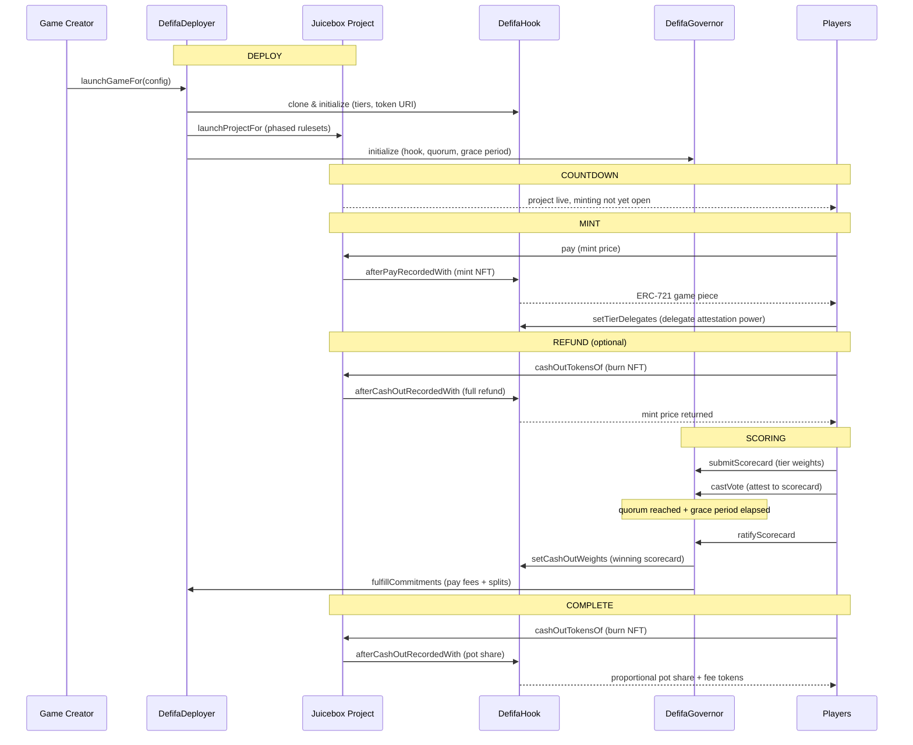

# Defifa

On-chain prediction games built on Juicebox. Players mint NFT game pieces representing teams or outcomes, a governor-based scorecard system determines payouts, and winners burn their NFTs to claim proportional shares of the pot.

Each game is a Juicebox project with phased rulesets that move through Countdown, Mint, Refund, Scoring, and Complete. The game's pot is the project's surplus. Anyone can launch a game by calling the deployer.

## How It Works

### Minting

During the Mint phase, players pay the project's terminal to mint ERC-721 game pieces. Each tier represents a team or outcome -- all tiers share the same price. Minting delegates attestation power to the payer (or a specified delegate), which is used later during scorecard governance.

### Refunds

If an optional Refund phase is configured, players can burn their NFTs after minting closes to reclaim the full mint price. This gives players an exit window before the game locks in.

### Scoring

Once the game starts, anyone can submit a **scorecard** -- a proposed distribution of the pot across tiers. Scorecards are attested to by NFT holders, weighted by their tier-delegated voting power. Each tier contributes equal attestation power regardless of supply (capped at `MAX_ATTESTATION_POWER_TIER`), so a tier with 1 NFT has the same governance weight as a tier with 100 NFTs.

Once a scorecard reaches 50% quorum and its grace period elapses, it can be ratified. Ratification sets the cash-out weights on the hook and fulfills fee commitments (Defifa fee + protocol fee + user splits).

### Cash Outs

After ratification, the game enters the Complete phase. Players burn their NFTs via the terminal's `cashOutTokensOf` to claim their proportional share of the remaining pot. Each NFT's share is its tier's scorecard weight divided by the tier's minted supply. Players also receive a proportional share of any fee tokens ($DEFIFA / $NANA) that accumulated from the game's fee payments.

### Safety Mechanisms

Two configurable safety mechanisms prevent games from getting stuck:

- **Minimum participation** (`minParticipation`) -- if the pot never reaches a threshold, the game enters No Contest and all players can refund at mint price.
- **Scorecard timeout** (`scorecardTimeout`) -- if no scorecard is ratified within a time limit after scoring begins, the game enters No Contest.

## Architecture

```
DefifaDeployer ──── launches ────► Juicebox Project (phased rulesets)
     │                                    │
     ├── clones ──► DefifaHook (ERC-721 game pieces, cash-out weights)
     │                   │
     │                   └── uses ──► JB721TiersHookStore (tier storage)
     │
     └── initializes ──► DefifaGovernor (scorecard governance)
                              │
                              └── owns ──► DefifaHook (sets weights on ratification)
```

### Contracts

| Contract | Description |
|----------|-------------|
| `DefifaDeployer` | Game factory. Clones the hook, launches a Juicebox project with phased rulesets (Mint → Refund → Scoring), initializes the governor, and manages post-game commitment fulfillment (fee payouts). Also serves as the game phase and pot reporter. |
| `DefifaHook` | ERC-721 game piece hook (extends `JB721Hook`). Manages tier-based cash-out weights, per-tier attestation delegation with checkpointed voting power (`Checkpoints.Trace208`), and custom cash-out logic that distributes the pot proportionally based on the ratified scorecard. Deployed as minimal proxy clones. |
| `DefifaGovernor` | Scorecard governance. Accepts scorecard submissions (tier weight proposals), collects attestations weighted by tier-delegated voting power, and ratifies scorecards that reach 50% quorum. Executes the winning scorecard on the hook via low-level call. |
| `DefifaHookLib` | Library with pure/view helpers: scorecard validation, cash-out weight calculation, fee token distribution, attestation unit aggregation. Extracted to stay within EIP-170 contract size limits. |
| `DefifaTokenUriResolver` | On-chain SVG token URI resolver. Renders dynamic game cards showing phase, pot size, rarity, team name, and current value using embedded Capsules typeface. |
| `DefifaProjectOwner` | Receives the Defifa fee project's ownership NFT and permanently grants the deployer `SET_SPLIT_GROUPS` permission. |

### Game Lifecycle

| Phase | Ruleset Cycle | What Happens |
|-------|---------------|--------------|
| `COUNTDOWN` | 0 | Project launched, minting not yet open. |
| `MINT` | 1 | Players pay to mint NFT game pieces. Cash outs return full mint price (refund). Delegation can be set. |
| `REFUND` | 2 (optional) | Minting closed, refunds still allowed at face value. Delegation can still change. |
| `SCORING` | 3+ | Game started. Scorecards submitted, attested to, and ratified via governor. Delegation frozen. |
| `COMPLETE` | -- | Scorecard ratified. Commitments fulfilled. Players burn NFTs to claim pot share + fee tokens. |
| `NO_CONTEST` | -- | Safety mechanism triggered. All players can refund at mint price. |

### Game Lifecycle Flow



### Fee Structure

| Fee | Rate | Recipient |
|-----|------|-----------|
| Protocol fee | 2.5% (`BASE_PROTOCOL_FEE_DIVISOR = 40`) | Base protocol project |
| Defifa fee | 5% (`DEFIFA_FEE_DIVISOR = 20`) | Defifa project |
| User splits | Configurable | Custom split recipients |

Fees are taken as payouts during commitment fulfillment. The remaining surplus is available for player cash outs. Fee payments generate $NANA and $DEFIFA tokens, which accumulate in the hook and are distributed proportionally to players when they cash out.

### Structs

| Struct | Purpose |
|--------|---------|
| `DefifaLaunchProjectData` | Full game configuration: name, tiers, token, durations, splits, attestation params, safety params, terminal, store. |
| `DefifaTierParams` | Per-tier config: name, reserved rate, beneficiary, encoded IPFS URI. Price is set uniformly via `tierPrice` on the launch data. |
| `DefifaTierCashOutWeight` | Scorecard entry: tier ID and its cash-out weight. Weights must sum to `TOTAL_CASHOUT_WEIGHT` (1e18). |
| `DefifaOpsData` | Packed game timing and safety params: token, start, mint duration, refund duration, min participation, scorecard timeout. |
| `DefifaDelegation` | Delegation assignment: delegatee address and tier ID. |

### Enums

| Enum | Values |
|------|--------|
| `DefifaGamePhase` | `COUNTDOWN`, `MINT`, `REFUND`, `SCORING`, `COMPLETE`, `NO_CONTEST` |
| `DefifaScorecardState` | `PENDING`, `ACTIVE`, `DEFEATED`, `SUCCEEDED`, `RATIFIED` |

## Risks

- **Scorecard timeout gap.** The `scorecardTimeout` safety mechanism triggers No Contest only if no scorecard is ratified before the deadline. However, if `minParticipation` was already met (pot above threshold), the minimum-participation safety net does not apply. A game can get stuck in the `SCORING` phase indefinitely if valid scorecards are submitted but never reach quorum -- the timeout only fires when _no_ scorecard is ratified in time, so a perpetually-contested game with active but insufficient attestation has no automatic resolution path.

- **Attestation power is per-tier, not per-NFT.** Each tier contributes equal governance weight (capped at `MAX_ATTESTATION_POWER_TIER`) regardless of how many NFTs were minted in that tier. A tier with 1 NFT holder has the same attestation power as a tier with 100 holders. This means a player who is the sole holder of a low-supply tier controls disproportionate voting power relative to their capital at risk, which could be exploited to steer scorecard outcomes.

- **Fee token accumulation depends on external terminals.** When commitments are fulfilled, fee payments to the Defifa and protocol projects generate $DEFIFA and $NANA tokens that accumulate in the hook for later distribution to players. If the receiving projects' terminals revert (e.g., paused, migrated, or misconfigured), the `fulfillCommitments` call will fail, blocking the game from entering the `COMPLETE` phase. Players would need to wait for the external terminal issue to be resolved before they can cash out.

- **Ratified scorecards are permanent.** Once a scorecard is ratified by the governor and cash-out weights are set on the hook, those weights cannot be changed for that game. There is no mechanism to re-score or appeal. If a scorecard is ratified with incorrect weights (e.g., due to a rushed attestation or a governance attack during low participation), the payout distribution is locked in permanently.

## Repository Layout

```
defifa-collection-deployer-v6/
├── src/
│   ├── DefifaDeployer.sol          -- Game factory, phase/pot reporter, commitment fulfillment
│   ├── DefifaGovernor.sol          -- Scorecard governance, attestation, ratification
│   ├── DefifaHook.sol              -- ERC-721 game pieces, cash-out weights, delegation
│   ├── DefifaProjectOwner.sol      -- Defifa fee project ownership holder
│   ├── DefifaTokenUriResolver.sol  -- On-chain SVG token URI renderer
│   ├── enums/
│   │   ├── DefifaGamePhase.sol     -- COUNTDOWN, MINT, REFUND, SCORING, COMPLETE, NO_CONTEST
│   │   └── DefifaScorecardState.sol -- PENDING, ACTIVE, DEFEATED, SUCCEEDED, RATIFIED
│   ├── interfaces/
│   │   ├── IDefifaDeployer.sol
│   │   ├── IDefifaGamePhaseReporter.sol
│   │   ├── IDefifaGamePotReporter.sol
│   │   ├── IDefifaGovernor.sol
│   │   ├── IDefifaHook.sol
│   │   └── IDefifaTokenUriResolver.sol
│   ├── libraries/
│   │   ├── DefifaFontImporter.sol  -- Capsules typeface loader for SVG rendering
│   │   └── DefifaHookLib.sol       -- Scorecard validation, cash-out math, fee distribution
│   └── structs/
│       ├── DefifaAttestations.sol
│       ├── DefifaDelegation.sol
│       ├── DefifaLaunchProjectData.sol
│       ├── DefifaOpsData.sol
│       ├── DefifaScorecard.sol
│       ├── DefifaTierCashOutWeight.sol
│       └── DefifaTierParams.sol
├── test/
│   ├── DefifaAdversarialQuorum.t.sol
│   ├── DefifaAuditLowGuards.t.sol
│   ├── DefifaFeeAccounting.t.sol
│   ├── DefifaGovernor.t.sol
│   ├── DefifaHookRegressions.t.sol
│   ├── DefifaMintCostInvariant.t.sol
│   ├── DefifaNoContest.t.sol
│   ├── DefifaSecurity.t.sol
│   ├── DefifaUSDC.t.sol
│   ├── Fork.t.sol
│   ├── SVG.t.sol
│   ├── TestAuditGaps.sol
│   ├── TestQALastMile.t.sol
│   ├── deployScript.t.sol
│   └── regression/
│       ├── FulfillmentBlocksRatification.t.sol
│       └── GracePeriodBypass.t.sol
├── script/
│   ├── Deploy.s.sol                -- Deployment script
│   └── helpers/
│       └── DefifaDeploymentLib.sol  -- Deployment helper library
├── lib/                            -- Git submodule dependencies
│   ├── base64/
│   ├── capsules/
│   ├── forge-std/
│   └── typeface/
└── docs/
    └── plans/                      -- Design documents
```

## Install

```bash
npm install @ballkidz/defifa
```

## Develop

Uses [npm](https://www.npmjs.com/) for package management and [Foundry](https://github.com/foundry-rs/foundry) for builds, tests, and deployments. Requires `via-ir = true` in foundry.toml.

```bash
curl -L https://foundry.paradigm.xyz | sh
npm install && forge install
```

| Command | Description |
|---------|-------------|
| `forge build` | Compile contracts and write artifacts to `out`. |
| `forge test` | Run the test suite (53 tests: unit, fuzz, invariant). |
| `forge test -vvvv` | Run tests with full traces. |
| `forge fmt` | Format Solidity files. |
| `forge build --sizes` | Get contract sizes. |
| `forge clean` | Remove build artifacts and cache. |
